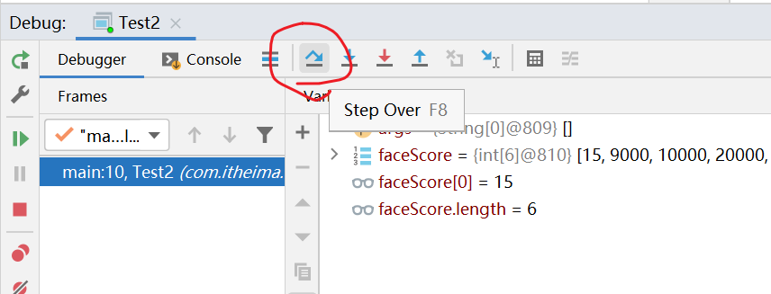

# <center>数组</center>
[toc]
### 一、数组的定义：
1. 数组是一个容器，用来存储一批同类型的元素。数组又分为：静态初始化数组，动态初始化数组，数组的操作。
2. 数组的基本原理：
数组储存的是地址，通过地址来查找里面的元素值。
3. 数组的访问：
   + 在数组中是通过索引来进行赋值和取值的;
   + 格式为：
     - 赋值：数组名[索引值] = 值;
     - 取值：数组名[索引值];
   + 索引值的取值为：n-1（n为改数的位置数），原理：数组中索引是从0开始的，而数是从1开始的，所以索引为n-1;
#### 1、静态初始化数组：
1. 完整格式：数据类型[] 数组名 = new 数据类型[]{元素1，元素2，...};
   简化格式：数据类型[] 数组名 = {元素1，元素2，...};
2. 特点：开始就确定了要保存的长度和里面的元素;
3. 使用场景：适合开始就给了特定的值，就使用静态初始化数组;
#### 2、动态初始化数组：
1. 格式：数据类型[] 数组名 = new 数据类型[数组长度];
2. 特点：开始就确定了长度(改长度可以定义的长点，导致后面为空值(里面的值取值于改数组元素的默认值),也不要定义短了，短了会报错)，后期为元素进行赋值;
3. 使用场景：开始不确定具体的元素值，就使用动态初始化数组
4. 动态初始化后的元素的默认值：
   <center>图片查看不了看1.png图片</center>
#### 3、数组的注意事项：
1. 数组定义的格式中，不能静态初始化数组和动态初始化数组同时出现：
例：数组类型[] 数组名 = new int[数组长度]{元素1，元素2，元素3...}这种写法是错误的。
### 数组的遍历
1. 数组的遍历是一个一个的访问数组中的元素，不仅仅是打印。
2. 遍历的原因：开发中的很多操作，比如求平均分，找最大值这些操作都需要遍历
3. 遍历的形式：
``` java
int[] ages = {20,30,40,50};
for(int i=0;i<ages.length;i++){
   System.out.println(ages[i]);
}
```
###  数组的内存图


    <center>图片查看不了看2.png图片</center>
1. 方法区：class文件执行的时候进入的区域(所有方法的归属地)
2. 栈区：方法运行的时候进入的区域，变量也是保存在栈区(所有变量的附属地)
3. 堆区：所有new出来的东西都在堆区(数组中元素也是在此);
4. <font color=#FF0000> 运行过程：执行——>进入方法区(找到mian方法)——>将main方法中的变量及运行方式进入栈内存中,在此方法中如果有new的东西便进入下一个1中，如果后面有遇到新的方法便进入方法去进行查找(如果还有方法依次重复，直到main方法运行结束)————>1中new的东西进入堆内存中</font>   
   
   总结：
   <font color=#FF0000>  
   1. 运行过程都在栈内存中进行  
   2. new的东西在堆内进行  
   3. 在进入方法区的时候首先进来的是main方法(主方法)  
   4. 一个程序可以有多个方法，但只能有一个main方法。
   </font>
### 数组使用的常见问题 
1. 索引越界异常：ArrayIndexOutOfBoundsException;问题出在：访问的索引超出了数组中元素最大索引。
2. 空指针异常：NullPointerException;问题出在：如果数组变量没有指向任何具体的数组，而去访问数组的元素或者调用数组的length属性等。

### IDEA中Debug工具的使用
好处：可以控制程序一步一步的执行，来查看代码执行问题。
步骤：
1. 打断点：程序边界点一下，边界出现红点加这一整行出现红色背景(断点);
2. 以debug的形式启动(右击该行代码),启动后会在断点暂停;
3. 界面下饭会有一个折型线，每点击一次，程序便会执行下一句，方便查漏问题
   