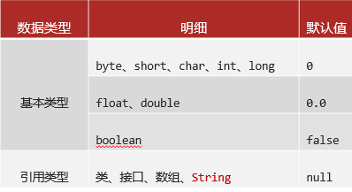
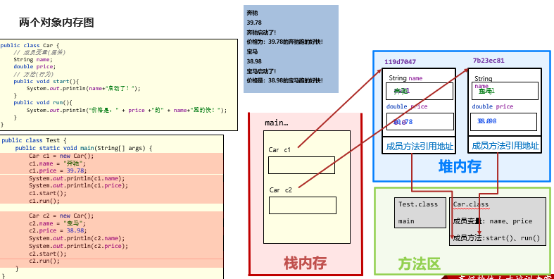

# <center>面向对象</center>
[toc]
### 面向对象编程
#### 1、什么是面向对象
+ 面向：找、拿。
+ 对象：东西
+ 面向对象编程：找或拿东西过来编程，解决实际问题。
+ 面向对象：现实世界中一切都是对象，万物皆对象
#### 2、面向对象的好处
让编程更简单，更加符合人类思维习惯，代码也容易理解
### 类，对象
#### 1、类
类想当于一个设计图，对一类事物共同特征的一个抽象
#### 2、对象
对象是类的具体实例，类==对象
#### 3、结论
在java中，必须先设计类，才能创建对象并使用
### 设计对象并使用
#### 设计类
```java
public class 类名{
    1、成员变量(代表属性，一般是名词)
    2、成员方法(代表行为，一般是动词)
    3、构造器
    4、代码块
    5、内部类
    (这一节主要讲了1、2、3)
}
```
#### 创建类的对象
格式：
类名 对象名 = new 类名()
#### 对象的属性和方法的访问
+ 访问属性：对象名.属性名;
+ 访问方法：对象名.方法名();
#### 定义类的注意事项
+ 类名首字母建议大写，且有意义，满足"驼峰模式"

+ 一个Java文件中可以定义多个class类，但只能一个类是public修饰，而且public修饰的类名必须成为代码文件名。
<font color="red">实际开发中建议还是一个文件定义一个class类。</font>
+ 成员变量的完整定义格式是：
  <font color="red">修饰符 数据类型 变量名称 = 初始化值；</font> 一般无需指定初始化值，存在默认值。

#### 对象属性默认初始值规则


### 对象内存图

+ 对象存放在堆内存中
+ 类名 对象名 = new 类名();对象名类名存的是对象在堆内存中的地址
```java
public class Test {    
  public static void main(String[] args) {        Student s1 = new Student();        
  s1.name = "小明";       
  s1.gender = '男';       
  s1.hobby = "游戏、睡觉、听课";        
  s1.study();       // 把学生类型的s1变量赋值给学生类型的s2变量    
  Student s2 = s1;       
  s2.hobby = "爱提问";        
  System.out.println(s2.name);        
  System.out.println(s2.gender);        
  System.out.println(s1.hobby);        
  s2.study();    
  }
}
public class Student {    
  String name;    
  char gender;    
  String hobby; // 爱好    
public void study(){        
  System.out.println(“名称：” + name + “，性别：” + gender+ “，爱好：" + hobby + "的学生：开始学习了！");   
 }
 }
```
该代码Student s2 = s1;中是将s1的地址赋值给了s2
+ 成员变量也就是类的属性的数据存放在对象中，因此存放在堆内存中。
+ 自动垃圾回收机制：如果一个对象没有任何变量指向它，那么就可以认为这个对象是垃圾对象了，会被回收。
### 构造器
#### 作用：
构造器也叫构造方法，是一种特殊的方法，定义在类中的，用来初始化一个类的对象，并返回对象的地址。
#### 构造器的格式
修饰符 类名(形参列表){
  代码块
}
```java
无参数构造器：
public 类名(){}
        
有参数构造器：
public 类名(类型 成员变量.....){
  this.成员变量=形参中的成员变量
}
```
#### 构造器的调用
类 变量名称 = new 构造器(无参);
类 变量名称 = new 构造器(有参);
### 构造器的分类
+ 无参数构造器
   - 初始化对象时，成员变量的数据采用默认值。
   - 有了对象之后，在调用setter方法为对象进行赋值
+ 有参数构造器
在初始化对象的时候自动为对象属性进行了赋值
### 构造器有哪些注意事项
+ 构造器的名字必须和类名保持一致。
+ 定义构造器的时候一定不能写返回值类型，void也不行。
+ 任何类定义出来，默认就自带了无参数构造器，写不写都有。
+ 一旦定义了有参数构造器，无参数构造器就没有了，此时就需要自己写无参数构造器了。
+ 构造器的修饰符可以写成private(私有的)，这样会导致该类变成死的，外面只能调用，无法进行修改
### this关键字
+ 作用：代表当前对象的地址
```java
类 变量名称 = new 构造器();
不管是有参还是无参，this所指的属性与类是有关
```
+ 可以用在构造器中和成员方法中：
   - 构造器：this调用当前的成员属性：
   ```java
   public Car(String name, double price) {
        this.name = name;
        this.price = price;
    }
   ```
   好处是形参的名字和成员属性名字保持一致，更专业
+ 用在成员方法中：
```java
public void goWith(String name) {
        // this用在方法中，谁调用这个方法this就代表谁
        System.out.println(this.name + "和" + name + "正在比赛！");
    }
```
### 封装
#### 什么是封装？
是面向对象三大特征(封装、继承、多态)之一，告诉我们如何设计类和对象
#### 封装思想概述
+ 封装的好处：
   - 有什么事，找对象，调方法就行，编程变得很简单。
   - 降低我们的学习成本，可以少学、少记。
+ 封装的原则
对象代表什么，就得封装对应的数据，并提供数据对应的行为。
例如：
  - 人画圆：画这个动作(方法)改放入人中还是圆中呢？  
  在画圆的过程中，人是不是起到一个调用的作用？反过来不是人画圆如果是动物画圆，那么始终不变的是不是画这个过程呢，所以是不是只要调用这个画就行了呢，然而在画圆的过程中你是不是得知道圆的半径这些，那半径这些是不是圆的属性也就是成员变量，所以你是不是可以将画这个过程(方法)写入圆中  
 #### 如何更好的封装
+ 一般建议对成员变量使用private(私有、隐藏)关键字进行修饰（private修饰的成员只能在当前类中访问）。
+ 必要的时候为成员变量提供配套public修饰的的getter、setter方法暴露其取值和赋值。  
例如：  
  ```java
   public class Movie {
   // 1.属性，private修饰
   private String name;
   private double score;
   private String actor;

    public Movie() {
    }

    public Movie(String name, double score, String actor) {
        this.name = name;
        this.score = score;
        this.actor = actor;
    }

    public String getName() {
        return name;
    }

    public void setName(String name) {
        this.name = name;
    }

    public double getScore() {
        return score;
    }

    public void setScore(double score) {
        this.score = score;
    }

    public String getActor() {
        return actor;
    }

    public void setActor(String actor) {
        this.actor = actor;
    }
   }
  ```
+ 封装的好处在于：让数据更安全，不对外直接暴露数据本身，同时也不需要对外暴露方法的实现细节
### JavaBeen
#### JavaBeen类型
+ 也可以称为实体类，其对象可以用于在程序中封装数据。
+ 学生类、老师类、汽车类都是javabean，但是测试类不是javabean
#### 书写格式
+ 成员变量使用 private 修饰。
+ 提供成员变量对应的 setXxx() / getXxx()方法。
+ 必须提供一个无参构造器；有参数构造器是可写可不写的。