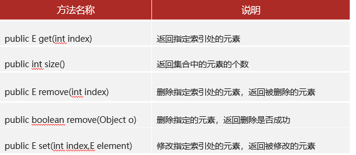

# <center>String、List集合</center>
[toc]
## String
### String概述
+ java.lang.String类代表字符串，String类定义的变量可以用于指向字符串对象，然后操作该字符串。
+ Java程序中的所有字符串文字(例如："abc")都为此类的对象。
+ String 变量名 = "";中变量名本质上存储的是地址，输出是字符串。
### String的不可变性  
 String其实常被称为不可变字符串类型，它的对象在创建后不能被更改。

#### 字符串对象存储位置


<font color="red">在String中，以""方式给出的字符串对象，在字符串常量池中存储(字符串常量是堆内存中一块特定区域)。但运算是在堆内存中运行。常量池中的数据只有当程序运行结束时才会清空。</font>
##### String是不可变字符串的原因？
+ String变量每次的修改其实都是产生并指向新的字符串对象。
+ 原来的字符串对象是没有改变的，所以称为不可变字符串。
### String类常用方法-字符串内容比较
#### 为什么要学习字符串的比较？
String类是一个引用数据类型，变量中存的是地址值，如果使用==进行比较，比较的是它们的地址值(引用数据类型)，但是很多时候我们需要比较字符里面的内容是否一致，不关心地址值。
#### 怎么进行比较呢？

#### 什么时候用==比较合适？
一般基本数据类型采用==来比较相等，引用数据类型采用equals方法来比较内容
### String类的常用方法-遍历、替换、截取、分割操作

### String类创建对象的2种方式
#### 方式一(直接使用)：  
直接使用英文双引号把我们的字符串内容包在中间就可以了
```java
String name = "传智教育";
```
#### 方式二(使用构造器)：
通过String类的构造器创建对象。

#### 两种方式有什么区别
+ 以“”方式给出的字符串对象，在字符串常量池中存储，而且相同内容只会在其中存储一份。
+ 通过构造器new对象，每new一次都会产生一个新对象，放在堆内存中。
### String类罕见的笔试题
1.
  
该flase的原因是：s3在堆内存中存储的地址和s4存储的地址不同，s4会重新书写一次并不会指向s3。
2.

该new的形参会先对字符串常量池中寻找是否有改形参，如果没书写完再在堆内存中书写一次。
3.

## ArrayList
### 集合概述
#### 什么是集合
集合是与数组类似，也是一种容器，用于装数据的
#### 集合的特点
+ 集合的大小不固定，启动后可以动态变化，类型也可以选择不固定。
+ 集合非常适合元素格式不确定，且要进行增删操作的业务场景。
+ 集合还提供了许多丰富、好用的功能，而数组的功能很单一。
### ArrayList集合入门
#### ArrayList对象的创建
使用构造器：ArrayList 对象名= new ArrayList()
#### ArrayList集合的添加元素的方法

### ArrayList对于泛型的支持
#### 泛型的概述
ArrayList<E>：其实就是一个泛型类，可以在编译阶段约束集合对象只能操作某种数据类型。  
例如：  
```java
ArrayList<String> list = new ArrayList<>();  
ArrayList<Integer> list = new ArrayList<>();  
ArrayList<Character> list = new ArrayList<>();  
```

注意：泛型只能支持引用数据类型，不支持基本数据类型；其中Integer是int的包装，Character是char的包装  
### ArrayList常用方法、遍历

### ArrayList集合可以储存自定义类型
自定义类型就是我们自己定义的类。  
例：  
ArrayList<Student> list = new ArrayList<>();  
ArrayList<Car> list = new ArrayList<>();  
其中 Student和Car为我们定义的类
  
  
其中Movie为我们自己创建的类，Movie movie = movies.get(i) 中movie获取的是对象的地址，并不是对象本身。
### ArrayList集合遍历并删除元素出现的问题
#### 采用for循环可能会遗漏删除数据
例：  
```java
import java.util.ArrayList;

public class Test4 {
    public static void main(String[] args) {
        // 需求：某个班考试成绩分别为：98, 77, 66, 89, 79, 50, 100
        // 现在需要临时删除分数低于80分的成绩
        // 1.用一个ArrayList存储一批分数
        ArrayList<Integer> scores = new ArrayList<>();
        scores.add(98);
        scores.add(77);
        scores.add(66);
        scores.add(89);
        scores.add(79);
        scores.add(50);
        scores.add(100);

        // 2.遍历集合，判断当前得到的分数是否低于80分，低于就删掉

        // 有问题的代码，不严谨，可能漏删数据
//        for (int i = 0; i < scores.size(); i++) {
//            int score = scores.get(i);
//            // 3.判断当前分数是否低于80分
//            if (score < 80) {
//                scores.remove(i);
//            }
//        }
        
        // 正确的解决方案1：每次删除一个元素，当前索引减1
//        for (int i = 0; i < scores.size(); i++) {
//            int score = scores.get(i);
//            // 3.判断当前分数是否低于80分
//            if (score < 80) {
//                scores.remove(i);
//                i--;
//            }
//        }

//        98, 89, 100
//      i
        // 正确的解决方案2：从后面往前倒着遍历
        for (int i = scores.size() - 1; i >= 0; i--) {
            int score = scores.get(i);
            // 3.判断当前分数是否低于80分
            if (score < 80) {
                scores.remove(i);
            }
        }

        System.out.println(scores);

    }
}
```